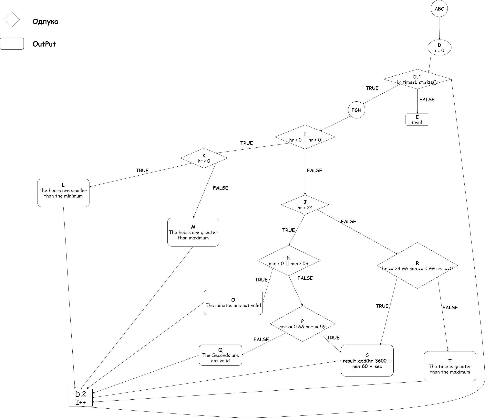

### НЕМАМ ИСКУЦАНО ТЕСТОВИ !!!

Втора лабораториска вежба по Софтверско инженерство

Иван Ѓаковиќ , бр. на индекс 173242

Control flow graph 

Цикломатската Комплексност 

Цикломатската комплексност на овој код е 8 , истата ја добив преку формулата 
P+1 , каде што P е бројот на предикатни јазли. Во случајов P = 7 , па цикломатската комплексност изнесува 8.

Тест случаи според критериумот Multiple Condition

if (hr < 0 || hr > 24) 
TX || FT || FF
if (min < 0 || min > 59) 
TX || FT || FF
if (sec >= 0 && sec <= 59) 
TT TF FX
else if (hr == 24 && min == 0 && sec == 0)
TTT TTF FXX TFX

Тест случаи според критериумот C1 - Every Branch
Вкупно се: 6.

12h 39m 44s  (Во јазол 6 одлучува дека условот е точен според 12* па оди во 7 каде очигледно условот не проаѓа па оди во 10 па во for назад , каде гледа дека нема други листи па го исполнуува и 2.1-2.2)
 
00h 39m 44s  (Во јазол 6 условот паѓа саатите не се ни помали а ни поголеми од 0 па така оди во 8 таму влага во условот па оди во 11 во 11 проаѓа па 13 па 2.3)

00h 00m 62s  (--||-- стигаме во јазол 11 , не влагаме таму , продужува во 14 , таму паѓа оди во 15 па во 2.3 ...)

-1h 22m 22s  ( -- || -- стигаме во 7 од таму саатите се помали од 0 па продужува во 10 па 2.3 --||--)

24h 24m 21s  ( на овој начин ке стигнеме до јазол 12 и условот ке падне скока на else т.е јазол 17 па 2.3 и се враќа у фор.)

24h 00m 00s	(--||-- ќе стигне до 12 и таму ке пројде влага во условот , па 16 па 2.3)
